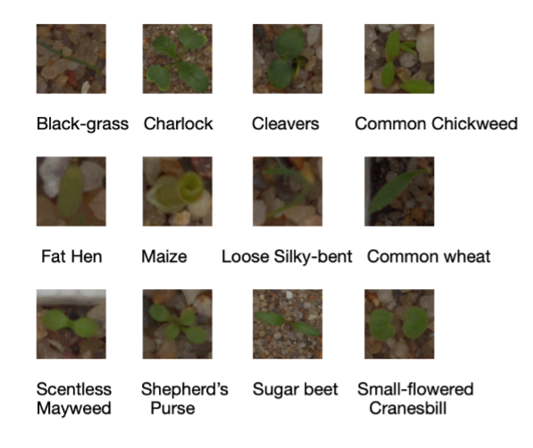

# Plant Seedling image classification

## Aim
This project aims to explore the performance of dif-ferent CNN models in plant seedling image clas-sification.

## Data set
The dataset that used in this researchcontains approximately 960 unit plants belonging to 12 species at several growth stages.
The dataset is hosted by Aarhus University ([here](https://vision.eng.au.dk/plant-seedlings-dataset/)). This dataset is also used for Benchmark of Plant Seedling Classification Algorithms ([Quick link to the paper](https://arxiv.org/abs/1711.05458))

There are 794 images in the test datasetand 4750 images are remained for training and validationdataset. To simulate the test dataset, we choose 794 imagesas our validation dataset which means the training datasethas 3956 images.

| Data sets | Number of Images |
| :---------: | :----------------: |
| Traning Set | 3956 |
| Validation Set | 794 |
| Test Set | 794 |

The input image size for CNN is 224*224,it means we need to resize all images to this size. See example image as below:

  

## CNN Models
The CNN models applied in this project includes ALexNet,VGG and GoogLeNet. 
We compare the test ac-curacy of each CNN models in our dataset and the conclusion is GoogLeNet has the best performance with 92 % test accuracy.  We also apply normalization methods like gray scaling andchannel standardization to preprocess the images.However, no significant improvements are detected with these two approaches

## Experiments

### Normalization
We tried two approaches for normalization:

1. Gray Scaling: The images are changed to greyscale
2. Channel  Standardization:For each channel, the pixel values are standardized to 0 mean and unit vari-ance. As a result, all inputs can be in a similar range of values.

### Three Experiments
The following experiments were run, based on three models:AlexNet, Inception V3 and VGG161. 

1. AlexNet, Inception V3, VGG162.  
2. AlexNet, Inception V3, VGG16)+standardization3.  
3. (AlexNet, Inception V3, VGG16)+Gray scaling

### Experiment result
#### Experiment 1

| Models | Best test\_acc ± one standard deviations |
| -----  | :-----: |
| AlexNet | 87.12\% ± 1.05\% |
| Inception V3 | 92.30\% ± 0.78\% |
| VGG16 | 88.03\% ± 1.08\% |

#### Experiment 2

| Models | Best test\_acc ± one standard deviations |
| -----  | :-----: |
| AlexNet | 87.13\% ± 0.56\% |
| Inception V3 | 90.61\% ± 1.21\% |
| VGG16 | 86.01\% ± 2.03\% |

#### Experiment 3

| Models | Best test\_acc ± one standard deviations |
| -----  | :-----: |
| AlexNet | 77.02\% ± 1.71\% |
| Inception V3 | 70.41\% ± 1.48\% |
| VGG16 | 75.13\% ± 2.12\% |

